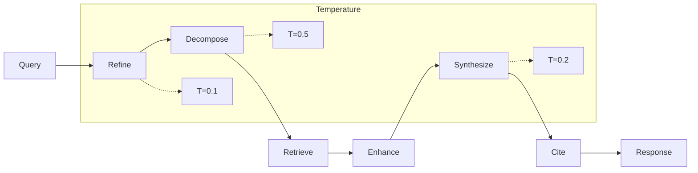
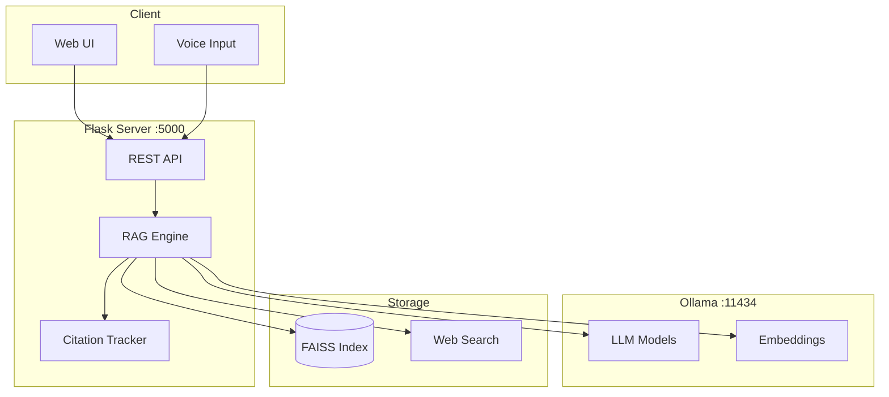

<p align="center">
  <h1 align="center">🌾 AgriIR</h1>
  <p align="center">
    <strong>Configurable RAG Framework for Domain-Specific Knowledge Retrieval</strong>
  </p>
  <p align="center">
    <a href="https://www.python.org/downloads/"></a>
    <a href="https://ollama.ai"></a>
    <a href="https://github.com/facebookresearch/faiss"></a>
  </p>
  <p align="center">
    <a href="https://ecir2026.eu/calls/call-for-ir-for-good-papers"></a>
    <a href="https://bit.ly/AgriIR"></a>
  </p>
</p>

<br/>

> **🏅 Accepted at [ECIR'26 IR for Good Track](https://ecir2026.eu/calls/call-for-ir-for-good-papers)** · [Watch Demo](https://bit.ly/AgriIR)

<br/>

## What is AgriIR?

AgriIR is a 6-stage retrieval-augmented generation pipeline for agricultural Q&A. It combines local vector search (FAISS) with web retrieval, applies domain-specific agents, and inserts deterministic citations into responses.

<br/>

## Pipeline



| Stage | Operation | Details |
|:-----:|:----------|:--------|
| 1 | Query Refinement | Remove ambiguity (Gemma3:1B) |
| 2 | Decomposition | Split into 3-5 sub-queries |
| 3 | Retrieval | FAISS + DuckDuckGo in parallel |
| 4 | Enhancement | Domain agent keyword injection |
| 5 | Synthesis | Generate answer (configurable model) |
| 6 | Citation | Insert sources where similarity ≥ 0.75 |

<br/>

## Quick Start

```bash
git clone https://github.com/Shuvam-Banerji-Seal/AgriIR.git && cd AgriIR
./install_agriir.sh
./start_agriir.sh
# Open http://localhost:5000
```

<br/>

## System Architecture



<br/>

## Installation

### Requirements

| | Minimum | Recommended |
|:--|:-------:|:-----------:|
| **Python** | 3.10 | 3.11+ |
| **RAM** | 8 GB | 32 GB |
| **GPU** | — | 8GB+ VRAM |


### Options

<details>
<summary><strong>Standard Installation</strong></summary>

```bash
./install_agriir.sh
```
</details>

<details>
<summary><strong>With Pre-built Embeddings (~40GB)</strong></summary>

```bash
./install_agriir.sh --download-embeddings
```
</details>

<details>
<summary><strong>Web Search Only (No Local DB)</strong></summary>

```bash
./install_agriir.sh --no-rag
```
</details>

<details>
<summary><strong>Manual Setup</strong></summary>

```bash
python3 -m venv agriir_env && source agriir_env/bin/activate
pip install -r requirements.txt
curl -fsSL https://ollama.ai/install.sh | sh
ollama pull gemma3:1b && ollama pull llama3.2:3b
```
</details>

### Models

| Model | VRAM | Role |
|:------|:----:|:-----|
| `gemma3:1b` | 1.6 GB | Query refinement |
| `llama3.2:3b` | 2 GB | Default synthesis |
| `gemma3:27b` | 16 GB | High-quality synthesis |
| `Qwen3-Embedding-8B` | 5 GB | Embeddings |

<br/>

## Usage

### Server Modes

| Command | Mode |
|:--------|:-----|
| `./start_agriir.sh` | Auto-detect |
| `python3 agri_bot_searcher/src/enhanced_web_ui.py` | Full RAG |
| `python3 agri_bot_searcher/src/enhanced_voice_web_ui.py` | Voice enabled |
| `python3 agri_bot_searcher/src/fallback_web_ui.py` | Web search only |

### API

```python
import requests

r = requests.post('http://localhost:5000/api/query',
                  json={'query': 'Wheat cultivation in Punjab'})
print(r.json())
```

| Endpoint | Method | Description |
|:---------|:------:|:------------|
| `/api/query` | POST | Submit query |
| `/api/status` | GET | System status |
| `/api/health` | GET | Health check |

<br/>


## Configuration

Files in `agri_bot_searcher/`:

| File | Purpose |
|:-----|:--------|
| `config.yml` | Main settings |
| `config/enhanced_rag_config.yaml` | RAG parameters |
| `.env.example` | Environment template |

<details>
<summary><strong>Example config.yml</strong></summary>

```yaml
ollama:
  base_port: 11434
  model: gemma3:1b

agents:
  max_agents: 6
  roles:
    - crop_specialist
    - disease_expert
    - economics_analyst
    - climate_researcher

search:
  agriculture_domains:
    - extension.org
    - fao.org
    - usda.gov
```
</details>

<br/>


## Contributing

We welcome contributions! Here's how to get started

1. **Fork** the repository
2. **Create a branch:** `git checkout -b feature/your-feature`
3. **Commit changes:** `git commit -am 'Add your feature'`
4. **Push to branch:** `git push origin feature/your-feature`
5. **Open a Pull Request**

> 💡 Please open an issue first to discuss major changes before submitting a PR.

<br/>
